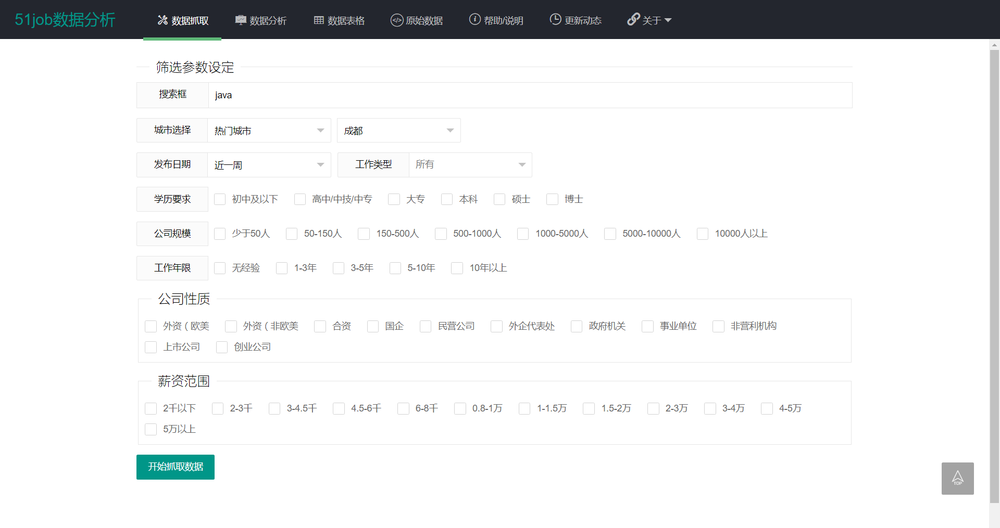
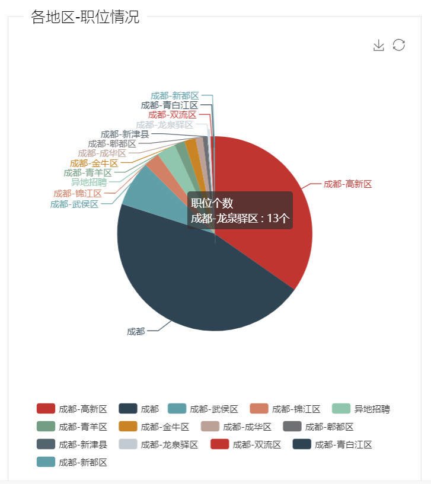
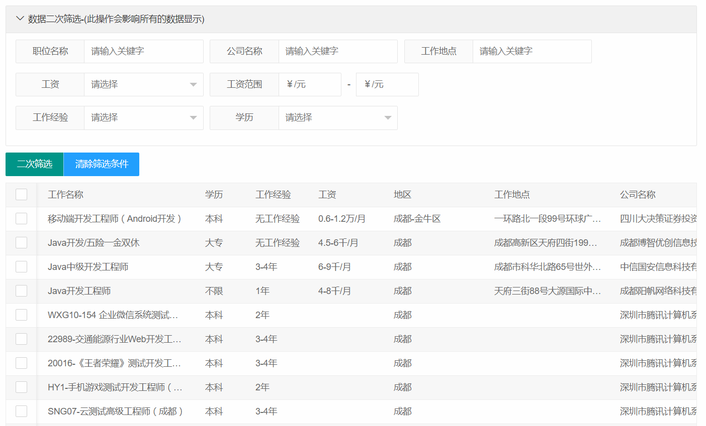
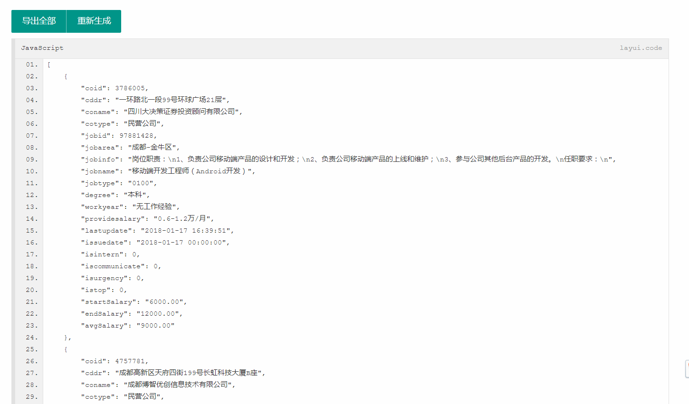

# 51job数据web端查询工具
1. 采用SpringBoot+Layer+Echarts+taffy(前端数据库)技术,对数据进行简单的查询并统计,直观的查看各个公司、地区的职位情况,方便找工作的各位能在该工具的帮助的情况
快速定位日后住房,不必投放的简历
2. [在线使用](https://51job.lihang941.club)
3. [51job数据入库自定义查询](https://github.com/lihang941/51job)
4. [接口示例](facade/src/main/resources/faq/README.md)

## 示例图片





## 有兴趣讨论的同学可以加群[小航博客交流群](https://jq.qq.com/?_wv=1027&k=4EPZ3Xr)

### 运行

```
依赖 JDK8 
```
#### git克隆
``` 
$ git clone https://github.com/wawa2222/51job-web.git
```
#### 使用Maven打包
```
$ gradlew[.bat] :facade:bootJar   
```
#### 启动
```
$ cd facade/build/facade-app.jar
$ java -jar facade-app.jar
```
#### 启动成功你会看到如下内容
``` 
  _        _   _    _                                    _____   __        _           _     
 | |      (_) | |  | |                                  | ____| /_ |      | |         | |    
 | |       _  | |__| |   __ _   _ __     __ _   ______  | |__    | |      | |   ___   | |__  
 | |      | | |  __  |  / _` | | '_ \   / _` | |______| |___ \   | |  _   | |  / _ \  | '_ \ 
 | |____  | | | |  | | | (_| | | | | | | (_| |           ___) |  | | | |__| | | (_) | | |_) |
 |______| |_| |_|  |_|  \__,_| |_| |_|  \__, |          |____/   |_|  \____/   \___/  |_.__/ 
                                         __/ |                                               
                                        |___/                                                

-51job数据分析工具  2017-12-13
-工具仅用于数据分析学习
-@LiHangBlog  http://www.lihang.xyz
-@QQ交流群     https://jq.qq.com/?_wv=1027&k=4EPZ3Xr
-@GitHub      https://github.com/wawa2222/51job-web
 .
 .
 . 省略
```
#### 浏览器打开 http://localhost:9099/  就可以看到页面了

### 更新动态

```

2018年1月17日
-优化数据查看性能。
-修改说明
-优化数据导出功能

2017年12月18日
-修复json数据导出问题
-新增说明

2017年12月11日
-本次更新内容为
-数据二次筛选,即抓取数据后的二次筛选
-新增两个统计方式
-新增导出数据
-新增统计的交互功能
-优化界面显示,防止卡死
-优化代码细节

2017年11月30日
-51job简单的数据分析悄然上线
-数据分析能力孱弱
-望各位给点灵感以及建议

```
### 其他开源作品
<table>
    <tr>
        <th>名称</th>
        <th>标签</th>
        <th>源码</th>
        <th>预览</th>
    </tr>
    <tr>
        <td>前程无忧数据入库工具</td>
        <td>JAVA</td>
        <td><a href="https://github.com/wawa2222/51job" target="_blank">源码</a></td>
        <td>无</td>
    </tr>
    <tr>
        <td>QQ表情贴贴贴</td>
        <td>java、android、xposed、weex</td>
        <td><a href="https://github.com/wawa2222/qqtietie" target="_blank">源码</a></td>
        <td><a href="https://www.coolapk.com/apk/156242" target="_blank">下载</a></td>
    </tr>
    <tr>
        <td>五子棋实现（包括AI）</td>
        <td>JavaScript、ab剪枝算法</td>
        <td><a href="https://github.com/wawa2222/piece" target="_blank">源码</a></td>
        <td><a href="https://piece.lihang941.club" target="_blank">预览</a></td>
    </tr>
    <tr>
        <td>小航博客</td>
        <td>java、ssm、redis、lucene</td>
        <td><a href="https://github.com/wawa2222/blog" target="_blank">源码</a></td>
        <td>无</td>
    </tr>
    <tr>
        <td>寝室管理系统</td>
        <td>java、ssh</td>
        <td><a href="https://github.com/wawa2222/scms" target="_blank">源码</a></td>
        <td>无</td>
    </tr>
    <tr>
        <td>扫雷游戏</td>
        <td>java</td>
        <td><a href="https://github.com/wawa2222/mine" target="_blank">源码</a></td>
        <td>无</td>
    </tr>
</table>
